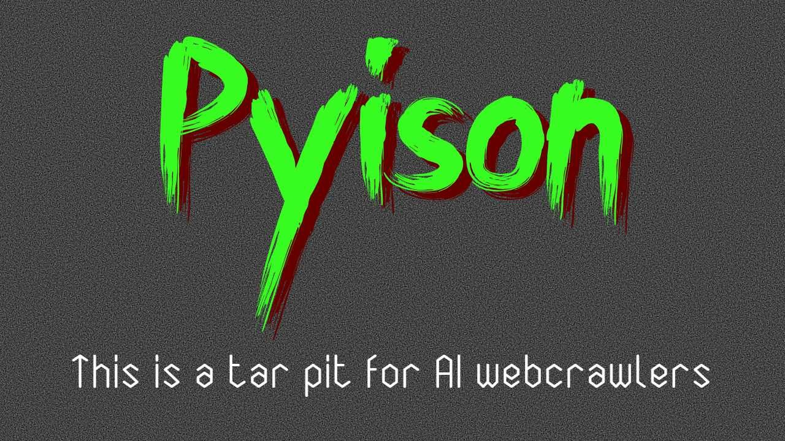

- # Pyison
	- Pyison is a tarpit for AI webcrawlers
	- ## Introduction
		- Like all web crawlers, AI bots request pages from webservers, and then follow links on the page to other pages. By doing this, they can build an index of an entire website.
		- Unlike other web crawlers, though, AI bots present some unique issues
			- Server admins can configure a [robots.txt file](https://en.wikipedia.org/wiki/Robots.txt), which tells web crawlers what pages they should and shouldn't crawl.
				- Some AI crawlers have been found to ignore this file. There are privacy and copyright concerns with allowing these bots to use a website's data to train LLMs, especially when the user has explicitly opted out of crawling.
				- Some crawlers also ingore ratelimiting. When they request pages as fast as possible, they can put significant load on a webserver
		- Enter Pyison. Like other AI crawler tarpits (Nepenthes, Iocane), Pyison feeds web crawlers an endless list of links to other pages on its site. This traps the crawlers on a single site, where they'll endlessly navigate an ever-growing sea of links.
			- Keeping AI crawlers stuck in one place prevents them from indexing other parts of the site that the owner might not want to feed to LLMs.
			- At the same time, these pages can contain tons of useless text. When LLMs incorporate this text into their models, they can gradually be "poisoned" as the random input will make their responses less coherent.
			
		- ## Motivations
			- Creating useful software to address the rise in LLM content thievery
			- Solving problems in existing AI tarpits:
				- Generating random text without use of a Markov Chain, LLMs, or any existing writing samples
				- Not discriminating AI bots by User-Agent header, since crawlers will often disguise themselves as normal users
				- Designing a realistic blog-esque site in order to prevent detection
					- Creating an extremely customizable framework to allow further configuration
				- Providing a solution that can easily integrate into an existing website
					- Supports but doesn't require reverse proxies/specific webservers, provides sub-path configuration with a document root setting
				- Running with a small footprint rather than an entire CMS or feature-rich webserver
	
	- ## Technical Specifications
		- This project runs a dynamic web server using Python's HTTPServer library
		- Sentences are produced from a 50/50 mix between random english words and "stop words"
		- Pyison uses a global salt as well as a page url to seed its RNG. This ensures that if crawlers ever perform a "sanity check" by reloading a page, it will be the same as the last time they checked it. At the same time, different servers should use different global seeds so that not all sites using Pyison look the same.
		- It's possible to generate an unlimited number of pages, since Pyison isn't actually creating any permanent files. It's a dynamic web server, so it just generates html and sends it to the client.
		- Use of HTML content tags, CSS formatting, and images should make the site seem a bit more realistic to a crawler.
		- It's possible to configure Pyison's output without rewriting the program, by changing the config, static, and template files
		- Pyison responds to errant POST and PUT requests with a 404 in case crawlers test that those HTTP verbs are configured

	- ## Getting Started
		- Clone this project to a local folder
		- Change settings in the `config.json` file
			- Set the `random-seed` to a random number!
			- Set the `port` number for the server to use
		- (Optional but recommended) Update the HTML template, CSS, images, and robots.txt to your liking
			- This project is more effective if pages look different, which can be done by varying the HTML and CSS structure. Rearrange and rename some stuff, or rewrite it completely.
		- (Optional) Edit the robots.txt if you want to capture more bots
		
		- ### Running locally
			- Install nltk
				- `pip install nltk`
			- Run Pyison
				- `python3 server.py`
			- Check it's running
				- Open `http://localhost:<your port number>` in a browser
		
		- ### Docker
			Coming soon
	
		- It is **highly recommended** that you use a reverse proxy to serve this content. It can reduce server load by caching pages and introducing ratelimits, as well as serve the content over https and protect from some basic webserver exploits.
			- ### Reverse Proxy
				- Nginx Proxy Manager
					-
					  ```
					  location / {
					  	proxy_pass http://localhost:80;
					      proxy_buffering off;
					  	proxy_pass_header User-Agent;
					  }
					  ```
					- Set "80" to whatever port is defined in the config
					- If you're using a docker network, replace "localhost" with the Pyison container's name

	- ## Configuration
		- The config.json file defines various settings for easy customization:
		- `port` (default 80)
			- What port to serve content on
		- `random-seed` (Please change this!)
			- Global seed (salt) used to make sure not every webserver has the exact same text
			- Set this to some random number, doesn't need to be secure
		- `document-root` (default "/")
			- Prepends a path onto links
			- You'll only need to change this if you're using a reverse proxy and serving to a sub-directory
				- If so, use either a fully-qualified path or one relative to the root
					- ie `https://example.com/pyson/` or `/pyson/`
		- `fake-image-dir` (default ["/images"])
			- All images will appear to be served from this path
			- Accepts either a single string, or a list of options to randomly choose from
		- `fake-css-dir` (default ["/css"])
			- All css files will appear to be served from this path
			- Accepts either a single string, or a list of options to randomly choose from
		- `spacing-characters` (default ["_","-","%20"])
			- Spaces to use between the words in a page URL
			- This will also affect how page URLs are split to decode back into titles
		- `unsafe-characters` (default ["'","`"])
			- Characters that can occur naturally in the word list but should be removed from URLs
			- By default, this removes apostrophes (`) and single quotes (')
		- `robots-txt` (default "robots.txt")
			- This configures the file that gets served at `/robots.txt`
			- If the string is empty, a 404 response will be returned instead
		- `html-templates` (default ["template.html"])
			- HTML file to serve, containing format text to provide random values for (see HTML Templating)
			- Accepts either a single string, or a list of options to randomly choose from
		- `css-files` (default ["style.css"])
			- CSS file(s) to serve
			- No substitution is done on CSS files
			- Accepts either a single string, or a list of options to randomly choose from
		- `images`
			- `ico` (default ["logo.ico"])
			- `jpg` (default ["logo.jpg"])
			- `png` (default["logo.png"])
			- For each of the above image extensions: A single image file, or a list of images to pick randomly from
		- `remove-from-stop-words`
			- The nltk library has a "stop words" list that's useful to generate lots of common words. However, some entries shouldn't be used for text generation because they're an obvious giveaway that this is generated content
	
	- ## HTML Templating
		- Before serving your HTML file(s), Pyison will replace
		- ### Static values
			- When one of these tags is specified multiple times in the template, each value will be the same
			- `{TITLE}`
				- Title text of the page, based on the current URL
					- ex '/blog/about/once-upon-a-time' -> 'Once Upon A Time'
			- `{UPTITLE}`
				- Title text of the parent page, generated from the current URL
			- `{MAIN}`
				- This should be used as the site's main content. It will generate several paragraphs containing random text, along with section headings and subheadings. Random links may also be present throughout each paragraph.
			- `{UP}`
				- Path to the parent page
				- eg: `/blog/about/once-upon-a-time` -> `/blog/about`
			- `{CSSLINK}`
				- Random URL to a CSS document
				- The beginning path of this URL (eg `/styles`) can be set in the config
				- Make sure to specify '.css' immediately after the tag. This is how the webserver knows to send css rather than more html.
					- The actual document returned by the server will be chosen based on the css page(s) specified in the config
				-
		- ### Dynamic values
			- Each occurrence of these tags will be replaced by a unique value
			- `{WORD}`
				- Generates a single random word. Proper nouns may be capitalized.
			- `{NAME}`
				- Generates two capitalized words with a space in between.
			- `{SENTENCE}`
				- Generates a random sentence starting with a capital letter and ending with a period.
			- `{PIC}`
				- Generates a random URL to an image file
				- The beginning path of this URL (eg `/images`) can be set in the config
				- Make sure to put an appropriate file extension after the link (.png, .jpg, .ico)
					- The actual image returned by the server will be chosen based on the provided extension and the image(s) specified in the config
			- `{LINK}`
				- Generates a random link, which may contain sub-paths
				- The page name may be separated by dashes or underscores
				- eg: `/dressage/electrochronometer/himself-she-eciliate`
			- `{OVER}`
				- Generates a random link to a sibling page
				- eg: Using `{OVER}` on `/neighborliness/wont_unhonest` might generate a page to `/neighborliness/hooliganism`
			- `{NEWTITLE}`
				- Generates a random title
				- Uses a series of random words in Title Capitalization
				- eg: 'Nectarial Electrofusion Which Dephosphorization'
				- If this is followed by a `{LINK}` or `{OVER}` tag, the title and link will by synced
					- eg: `<a href="{OVER}">{NEWTITLE}</a>` might be replaced with
					- `<a href="{/unskimmed/swordmanship/yeller/over-will-oghuz}">Over Will Oghuz</a>`
				- `{LINK}` and `{OVER}` tags that aren't paired with a `{NEWTITLE}` may misalign subsequent paired tags


- # Images


  
Here is a sample of how the site looks before any editing of the template:
   

